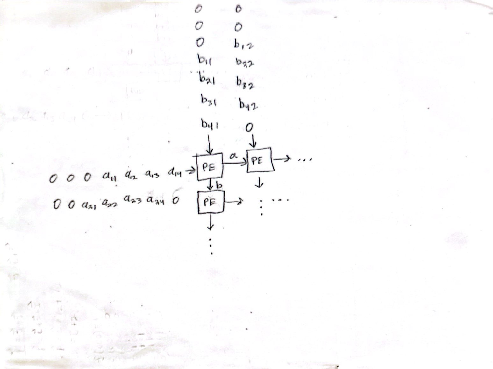

# Matrix Multiplication Implementing Using a Systolic Architecture 

This project implements a scalable systolic array architecture for computing matrix multiplication on square matrices of configurable size 𝑀×𝑀, It uses a grid of multiply-and-accumulate processing elements (PEs), arranged such that data flows horizontally and vertically through the array in a pipelined and synchronized fashion. This enables high-throughput and efficient parallel computation. 

Systolic Array Architecture Design:

## Systolic Array Design

### Inputs:
- `clk`, assume positive edge triggers
- `rst`, an active high synchronous reset
- `a`, an array stream of rows from matrix A
- `b`, an array stream of columns from matrix B
- `vld_in`, handshake valid in
    - goes high when a and b is valid, indicating to start to using the systolic array
- `rdy_out`, ready out
    - goes high when the matrix multiplication accelerator's output has successfully been read from 

- Note: we want to use an array for our inputs in order for the systolic array to be reconfigurable for any MxM matrix

### Outputs:
- `rdy_in`, held high by the accelerator when it is ready to take a new input
- `c`, 2D array of the matrix C
- `vld_out`, held high by the accelerator when its output is ready
- `rdy_in`, held high by the accelerator when it is ready to take a new input

## Multiply and Accumulate Processing elements

### Inputs:
- `clk`, assume positive edge triggers
- `rst`, an active high synchronous reset
- `a`, an 8 bit signal for an element from Matrix A
- `b`, an 8 bit signal for an element from Matrix B
- `en`, enable computing multiply and accumulate 

### Outputs:
- `c`, result of multiply and accumulate
- `a_out`, pass input a. This is necessary for passing a to the processing element to its right
- `b_out`, pass input a. This is necessary for passing b to the processing element to its bottom

## Testbench & Simulation

## synthesis and Waveform
